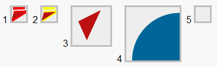

# CanvasGear 0.1.2

**Slogan** : CanvasGear is a JavaScript program to draw animated canvases by just specifying some parameters.

**Home** : CanvasGear home is [downtown.trilo.de/svn/demosjs/trunk/canvasgear](http://downtown.trilo.de/svn/demosjs/trunk/canvasgear/index.html).

**Status** : Proof-of-concept.

**Demos** : See chapter [Demo](http://downtown.trilo.de/svn/demosjs/trunk/canvasgear/demo.html).

**Features** : See chapter [Features](http://downtown.trilo.de/svn/demosjs/trunk/canvasgear/features.html).

### Quickstart

Copy [`canvasgear.js`](./canvasgear.js) and [`canvasgearexcanvas.js`](./canvasgearexcanvas.js)
to your web folder.

Then put the following ingredients into your HTML file :

```
<!DOCTYPE HTML>
<html>
<head>
<script src="./canvasgear.js"></script>                    <!-- (1) load script -->
<!--[if lte IE 9]><script src="./canvasgearexcanvas.js"></script> <![endif]--> <!-- (2) load IE compatibility -->
<body onload="startCanvasGear();">                         <!-- (3) start processing -->
 <canvas id="myCanvas44" width="123" height="123"></canvas> <!-- (4) define canvas -->
 <!-- algo=pulse color=hotpink hertz=0.2 -->               <!-- (5) specify canvas parameters -->
<body>
<html>
```

 1. In the HTML header, insert the script tag to load canvasgear.js.
 2. In the HTML header, insert the line to conditionally load canvasgearexcanvas.js.
 3. In the body tag, provide attribute 'onload="startCanvasGear()"'.
 4. Somewhere inside the body, define one or more canvases.
 5. In a comment immediately behind each canvas, specify the canvas parameters.

Now should the defined canvases should appear on your page.

Details about the installation you find in chapter [Installation](http://downtown.trilo.de/svn/demosjs/trunk/canvasgear/install.html).

[](http://downtown.trilo.de/svn/demosjs/trunk/canvasgear/demo.html)

<small>*(2014-Sept-04)*</small>
